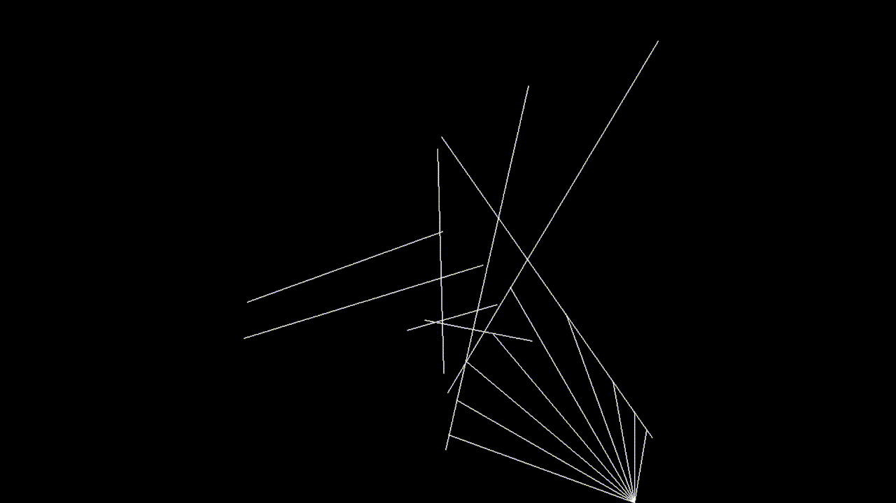

# 🔦 Raycasting Experiment

As an experiment, I decided to create a **raycasting demo** in Python using **Pygame**. This program **casts rays from the mouse cursor**, showing where they collide with any boundaries.  

🖥️ **Interactive and visually engaging!** Move the mouse and watch the rays dynamically react to obstacles.  

## 🎥 Demo


## 🚀 Installation
1️⃣ Clone the repository:  
```sh
git clone https://github.com/blakeldridge/Raycasting.git
cd Raycasting
```
2️⃣ Install Dependencies:
```sh
pip install pygame
```
3️⃣ Run the Program:
```sh
python main.py <boundary-number>
```
The *boundary-number* determines the amount of randomly spawned boundaries to appear.

## 🔧 Technologies Used
- 🐍 Python
- 🎮 Pygame

## 📬 Contact
Created by **[Blake Eldridge](https://github.com/blakeldridge)** - Feel free to reach out! <br>
📧 **Email** : blakeldridge@gmail.com <br>
💼 **LinkedIn** : [blakeldridge](https://www.linkedin.com/in/blake-eldridge/)
